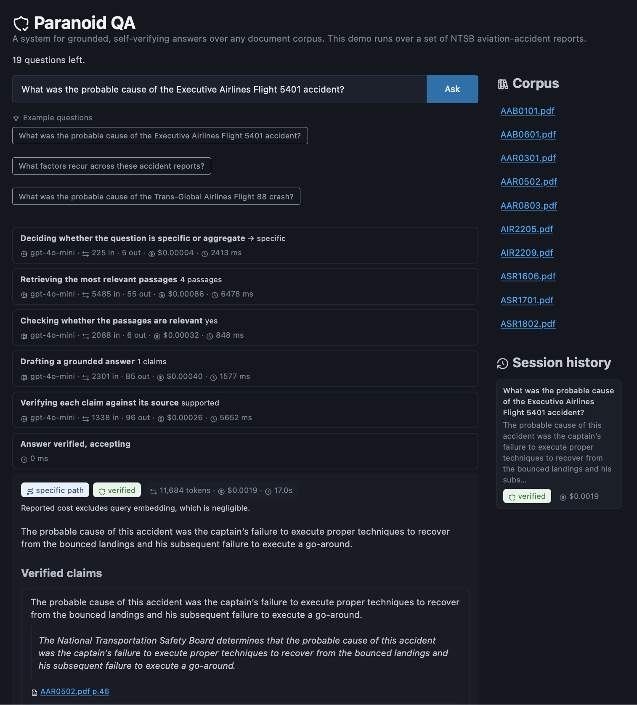
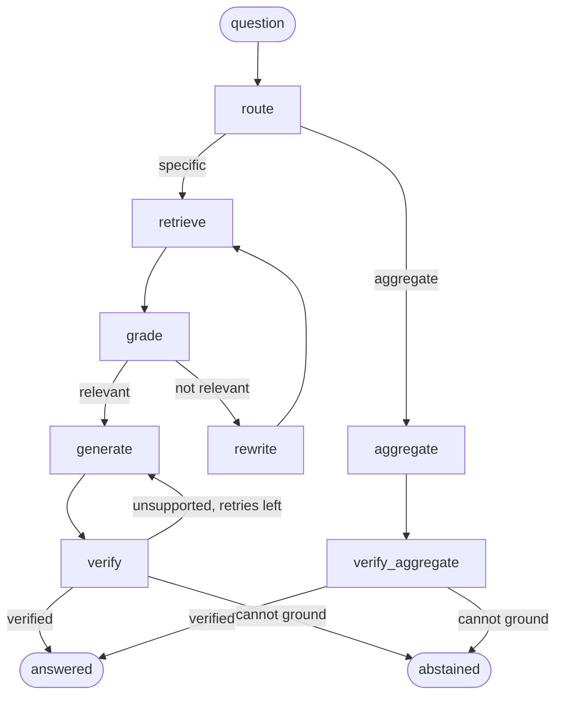

# paranoid-qa

[](https://github.com/haukit/paranoid-qa/actions/workflows/ci.yml)

A grounded, self-verifying question-answering service over a document corpus.

Every answer is decomposed into atomic claims, each backed by a verbatim quote from the sources. A separate critic (a different model), excluded from the generator's reasoning,  independently verifies that each quote (a) actually exists in the retrieved documents and (b) genuinely supports its claim, attaching the source citation (document + page). Unsupported or fabricated claims are regenerated with the critic's feedback, bounded by a retry budget; when no claim can be grounded within that budget, the service abstains rather than return an unsupported answer.

A live demo runs at [haukit.github.io/paranoid-qa](https://haukit.github.io/paranoid-qa/), over a corpus of real NTSB accident reports and gated behind an invite code (see [Deployment](#deployment)).



Stack: LangGraph (orchestration), LlamaIndex (hybrid retrieval + reranking), LightRAG (graph-based corpus-level retrieval), Pydantic (typed structured outputs), OpenAI (also supports local models via Ollama)

## Quickstart

```bash
uv sync
export OPENAI_API_KEY=sk-...        # the default provider is OpenAI

# A small fictional sample corpus ships in data/corpus/sample/ (generated by scripts/generate_toy_corpus.py) and is the default, so this runs as-is with no downloads.
# The evaluation and the deployed demo instead run on a sample of real NTSB accident reports (see Evaluation). Point at your own documents (PDF / Markdown / text) with:
#   export PARANOID_QA_CORPUS=/path/to/your/corpus
uv run python -c "from paranoid_qa.specific.indexing import build_specific_index; build_specific_index()"   # one-time specific-path index build
# The aggregate (corpus-level) path also needs its LightRAG graph; build both at once with:
#   uv run python scripts/build_indexes.py
uv run python -m paranoid_qa "your question here"
```

Run fully locally instead: `uv sync --extra ollama`, set `provider` / `embed_provider` to `"ollama"` in config, and `ollama pull qwen3.5:9b gemma4:12b bge-m3`.

## How it works

A router sends each question down one of two paths, each with its own grounding guarantee:



The engine is organized as two independently owned vertical paths, `paranoid_qa/specific/` and `paranoid_qa/aggregate/`, composed by `paranoid_qa/workflow/`. Shared corpus access lives in `paranoid_qa/corpus/`, typed contracts in `paranoid_qa/contracts/`, model construction and the critic-family policy in `paranoid_qa/llm/`, and the FastAPI service in `paranoid_qa/serving/`.

- route: classify the question as **specific** (about particular documents / events) or **aggregate** (corpus-level counts, trends, themes), then branch.

Specific path — grounded by verbatim quotes:

- retrieve: hybrid dense + BM25 retrieval, fused (reciprocal rank fusion) and reranked.
- grade: is the retrieved context relevant? If not, reformulate the query and retry.
- generate: emit the answer as `Claim{text, quote}` pairs, grounded strictly in the sources.
- verify: a deterministic check locates each quote in the sources (and mints its citation); a different-family critic then judges first whether the quote's source is even about the question's subject (a relevance gate) and only then whether it supports the claim. If no claim can be grounded within the retry budget, the run abstains (`status: abstained`) rather than return an unsupported answer.

Aggregate path — grounded by source references:

- lightrag: a knowledge graph built over the whole corpus answers corpus-level questions, such as counts and trends across many documents.
- verify_aggregate: grounds the answer against the documents it cited

## Configuration

All models, paths, and budgets live in [`paranoid_qa/config.py`](paranoid_qa/config.py). Models can be swapped easily ([`paranoid_qa/models.py`](paranoid_qa/models.py)), so switching providers (to local Ollama, or to Anthropic / Cohere) is a config change plus the matching extra (`uv sync --extra ollama|anthropic|cohere`).

## Evaluation

I built an evaluation harness on [Arize Phoenix](https://phoenix.arize.com/) to measure each part of the system.

My eval corpus is a sample of ten US National Transportation Safety Board (NTSB) aviation accident reports (AAB0101, AAB0601, AAR0301, AAR0502, AAR0803, AIR2205, AIR2209, ASR1606, ASR1701, ASR1802), drawn from a larger NTSB set and indexed with the current system (OpenAI `text-embedding-3-small`); you can download these PDFs from https://www.ntsb.gov/investigations/AccidentReports/Pages/Reports.aspx. The index is built once by `build_specific_index()` and persisted to `.storage/`; each query loads it from there.

### Retrieval recall

I started with retrieval because it sets the upper bound of performance on downstream nodes: if the chunk holding the answer never reaches the generator, the generation and verification would be handicapped.

I generated a labelled retrieval set of 53 questions from this corpus. This was done by sampling chunks from the index and using a stronger model (GPT-4o) to write a specific question whose answer lives in that chunk. The source chunk is thus the gold chunk by construction. The questions are also single-hop due to the nature of the generation. Sampling was stratified so sparse reports wouldn't go untested.

Across 53 questions:

| metric | value |
|--------|-------|
| Recall@4 (chunks delivered to the generator) | 0.943 |
| MRR | 0.846 |

Recall failed for the following three questions:

- A question that was not self-contained ("...the weather conditions at the airport during the incident?" is ambiguous over a multi-report corpus). A flaw in the question, not in retrieval.
- A well-specified question whose gold document was never retrieved: a genuine retrieval or reranking miss, or a question naming an entity that does not appear verbatim in the source.
- A question whose gold document was retrieved but whose specific gold page was not (chunks are keyed by page): page granularity, with the answer plausibly also present in a neighboring chunk.

Only the first was clearly a bad data point, so I removed it, leaving 52 questions: Recall@4 = 0.962, MRR = 0.862. The conclusion held either way: the current retrieval system holds up against this corpus.

Some thoughts:
- Under the current eval approach, low recall values do not clearly indicate whether the retriever or the reranker is the bottleneck. The reranker could have dropped a chunk it did retrieve, since it returns only a subset of retrieved chunks. The recall values were high for this corpus so I proceeded with confidence instead of further splitting up the eval (assuming eval set is reasonably difficult).
- MRR score is decently high, so this leaves headroom to pass fewer chunks to the generator and reduce the token usage.

### Critic verification

I measured the critic as a binary decision: of the claims it accepts, how many are grounded (precision), and of the grounded claims, how many it accepts (recall). Precision matters most here, since a false positive is an ungrounded claim reaching the user.

I generated a labelled set of 106 (claim, quote, source) triples from this corpus. This was done by using a stronger model (GPT-4o, a different model from the GPT-4o-mini critic to avoid self-preference) to write true claim-quote pairs from real chunks, then manufacturing hard negatives from them:
- `unsupported` swaps in a quote from a different report.
- `contradicted` flips one fact in the claim ("hard to release" becomes "easy to release"); these contradictions were generated with the stronger model as well.
- `fabricated` attaches a quote that is absent from the source.

Across 106 triples:

| metric | value |
|--------|-------|
| precision | 0.967 |
| recall | 1.000 |
| 4-way accuracy | 0.991 |

One claim was a false positive: a `contradicted` claim, "the NTSB recommended banning open-door flights with harnesses that are easy to release", was accepted as supported. The source bans the hard-to-release harnesses and exempts the easy-to-release ones, so it contradicts the claim. The critic matched on the shared topic and missed the inversion; its explanation even quoted the clause that refutes the claim.

### Self-verification ablation (specific path)

The question now is whether the verification node actually lowers the rate of ungrounded claims reaching the user.

I measured it as an ablation (`evals/verification_ablation.py`, gated by a `verify_enabled` toggle on the graph): run the specific path over the answerable questions twice, once with the verify/revise loop off and once on, and compare the fabrication rate, where a claim counts as fabricated if its quote cannot be located in the retrieved chunks.

I reused the questions from the retrieval eval above, since they are known to be answerable from the corpus, so any fabrication is the generator's fault rather than missing evidence.

| mode | fabricated / total |
|------|-------|
| loop off | 1 / 80 |
| loop on  | 1 / 80 |

The loop makes no measurable difference. Observations:
- The one failure in both loop off and loop on cases is the same. Asked for the NTSB's recommendation on weather minimums for Ketchikan air tours, the system gave the correct answer but spelled out an abbreviation in its quote: the source reads "develop and issue an SFAR", while the quote expanded it to "a special federal aviation regulation" (which is what SFAR stands for). The meaning is identical, but it is no longer a word-for-word copy, so the quote cannot be located in the source and is counted as fabricated. This is a near-miss on copying, not an invented fact, which is why both modes report it identically.
- On answerable, single-hop questions the generator rarely fabricates, so there is little for the critic to catch.
- The eval set used isn't adversarial / an unanswerable set in the first place, where fabrication is more common.

## Serving and scaling

The graph runs behind an async FastAPI `/ask` endpoint that streams progress through the graph (route, retrieve, grade, generate, verify) and then the grounded answer over Server-Sent Events. Every run is traced into Phoenix for per-call latency and cost.

The index is built from the NTSB corpus (see Evaluation), so the service answers questions such as "What was the probable cause of the Eagle flight 401 accident?" or "What did the NTSB recommend about weather minimums for Ketchikan air tours?".

I load-tested the endpoint with a concurrency sweep (`scripts/load_test.py`) where I ran through the same dataset of questions used in the retrieval eval but at increasing concurrency:

| concurrency | p50 (s) | p95 (s) | req/s | errors |
|-------------|---------|---------|-------|--------|
| 1 | 12.61 | 24.80 | 0.07 | 0 |
| 2 | 12.90 | 24.47 | 0.13 | 0 |
| 4 | 16.33 | 26.28 | 0.22 | 0 |
| 8 | 26.94 | 45.74 | 0.27 | 0 |

The `errors` column counts requests that hit a provider rate limit; it is zero at every level, so nothing was throttled and the saturation behaviour stands out clearly:
- c=1→2: throughput nearly doubles (0.07→0.13), latency flat.
- c=2→4: throughput +70% (0.13→0.22), latency creeps up.
- c=4→8: throughput only +23% (0.22→0.27), but latency doubles (16→27s p50, 26→46s p95).

One possible improvement is to cache the retriever, since it is rebuilt on every request (the index is reloaded from disk and the BM25 retriever reconstructed).

Token usage and cost: Each query averages 13300 prompt and 270 completion tokens, ~$0.0016 at gpt-4o-mini rates (about $1.60 per 1,000 queries). Cost is dominated by input tokens (48:1 prompt-to-completion ratio). This can be attributed to the RAG system that re-sends retrieved context as input on every call, while emitting short structured outputs.

## Deployment

I containerized the service and run it as a live, access-gated demo: a FastAPI backend on Render (Docker) and a static frontend on GitHub Pages. Both auto-deploy on merge.

- Image: a multi-stage Dockerfile installs dependencies with `uv` and bakes in the prebuilt `.storage` / `.lightrag` index, downloaded from a GitHub Release at build time rather than rebuilt on deploy (so no embedding or graph-extraction cost per deploy).
- Access control: the public endpoint is gated. A stable invite code is exchanged at `/demo/session` for a signed, expiring session token; each `/ask` then decrements a per-session quota, bounded by a global daily limit and a kill switch, with an OpenAI dashboard spend cap as the hard ceiling. Quotas are currently in-memory records.
- Frontend: a static page that streams the graph's progress live over SSE and renders the verified-claims panel, per-node model / tokens / cost / latency, a corpus browser with view-source, and session history.

## TODO

- Router: add few-shot examples to reduce phrasing-sensitive misroutes (e.g. "which report involves X" vs "how many reports involve X").
- Retrieval recall: raise `rerank_top_n` / `top_k`, or swap the LLM reranker for a cross-encoder (should be faster).
- Rewrite node: anchor to the original question, show the rejected docs, keep a rewrite history.
- Aggregate eval: rephrase questions to be more unambiguous and grade on the cited references rather than prose substrings.
- `verify_aggregate`: add an LLM entailment pass (does the answer follow from the cited documents?) on top of reference existence.
- Evaluation: generation faithfulness / answer relevance (LLM-judge), multi-hop retrieval with NDCG, the candidate-ceiling Recall@10, and harder critic negatives (more "unless"-style inversions).
- Deployment: durable Postgres-backed sessions and quotas (currently in-memory, reset on restart).

## License

MIT, see [LICENSE](LICENSE).
